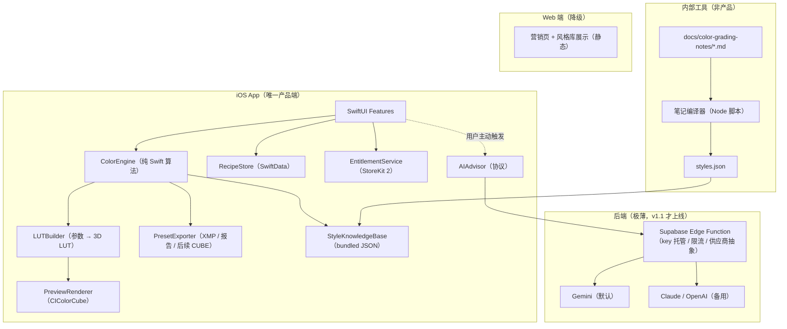

# ColorMatch v1 架构与商业化方案（Claude 拍板稿）

日期：2026-07-02
上游文档：`核心项目/ColorMatch/CLAUDE_HANDOFF.md`（Codex 整理）
状态：本文档是对交接文档 §7「需要 Claude 重点判断的问题」的逐条拍板 + 下一阶段工程方案。基于交接文档 §4.5–§11 内容拍板；§1–§4.4（现状细节与前四个竞品）未随文提供，涉及处已按后半部分引用的事实推断并标注。

---

## 0. 结论速览

| 决策点 | 结论 |
|---|---|
| 商业化方向 | 「参考图 → 可解释的 Lightroom 风格资产」工作流工具，不做滤镜 App，不做修图器 |
| v1 主卖点 | 本地双图仿色 + XMP 导出 + 风格报告（云 AI 只做增强，否决"云端 AI 生成滤镜图"路线） |
| 参数核心 | Swift 唯一真源，Web 端参数逻辑冻结，防分叉 |
| 预览层 | 立即改 Core Image，核心是 `参数 → 3D LUT → CIColorCube` 一条链，同一个 LUT 生成器未来直接复用为 CUBE 导出 |
| Gemini | 默认 AI 供应商，但只经后端代理调用，只做解释/命名/诊断，不生成参数 |
| 多模态识图 | 放云端（代理之后），用户主动触发，失败降级到本地知识库 |
| 第一付费点 | 无限 XMP 导出 + 完整风格报告（组合卡点） |
| 定价 | 一次性 Pro ¥38 早鸟 / ¥68 定价，v1 不做订阅 |
| Web 端 | 降级为营销页 + 风格库展示 + 内部笔记编译工具，不再是产品端 |
| 后端 | 一个极薄的 AI 代理（Supabase Edge Function），无用户系统，不存照片 |

---

## 1. 商业化方向：卖「可解释的风格资产」，不卖「一键变好看」

**结论：ColorMatch 的钱应该从「已经在用 Lightroom 的人」和「想学会调色的人」身上来，卖的是三件东西的组合：XMP 资产（工作流价值）+ 风格报告（教学价值）+ 风格包（内容价值）。**

理由：

1. **直接色彩迁移没有护城河。** MatchColors AI、Photomator「copy look」、Retouchr 都已覆盖「把 A 的颜色搬到 B」。在这条线上做得再好也是同质竞争，且 Photomator 有 Metal/Core ML 级别的工程投入，硬拼本地画质拼不过。
2. **「迁移之后呢」是竞品公认的断点。** MatchColors 的用户评论痛点就是：匹配完不能沉淀成 preset 就是一次性工具。ColorMatch 从第一天就输出 XMP + 中文步骤，这正好接住这个断点。
3. **调色视频字幕笔记是你独有的原料。** 竞品没有任何一家能回答「这像什么风格、为什么像、下一步怎么微调」。把笔记沉淀成结构化知识库后，每次仿色都附带一份有出处的风格解释——这是审美 + 教学的复合差异化，抄袭成本远高于抄一个算法。
4. **目标用户已被 Adobe 教育过付费。** Lightroom 用户买过订阅、买过别人的 preset pack（市场价 $10–$50/包），对「风格资产」有成熟的付费心智。免费滤镜 App 用户则几乎不付费。

一句话差异化（对 Retouchr / Lightroom / VSCO / Photomator）：

> **Retouchr 帮你修好这一张照片；ColorMatch 把任何参考图变成你自己的、可解释、可复用的 Lightroom 风格资产。**

---

## 2. v1 功能清单：6 个必做，其余全砍

### 2.1 v1 必做（缺一不可）

| # | 功能 | 验收标准 |
|---|---|---|
| 1 | 双图仿色（本地） | 原图 + 参考图 → `GradeParameters`；断网可用；同输入同输出（确定性） |
| 2 | Core Image 预览 | App 内预览与 XMP 导入 Lightroom 后的效果目视一致（6–10 组标准测试图对拍验收） |
| 3 | XMP + 中文步骤导出 | Share sheet 导出 `.xmp` + 风格报告；Lightroom mobile / Classic 导入即用 |
| 4 | 风格报告（本地版） | 匹配 StyleKnowledgeBase → 输出风格名、3–5 条参数解释、微调建议、适用/避免素材 |
| 5 | 我的配方 | SwiftData 保存配方 + 参考图缩略图 + 导出历史，可重导出 |
| 6 | Pro 付费墙 | StoreKit 2 一次性 Pro；免费限次逻辑；恢复购买 |

### 2.2 v1 明确不做（砍掉）

- 完整修图编辑器（和 Retouchr/Photomator 正面撞）
- 社区、账号系统、云同步
- Marketplace、大量社交模板
- CUBE LUT 导出（→ v1.1，面向视频人群的扩张点）
- 批量套用（→ v1.1 Pro）
- 云端 AI 诊断（→ v1.1，见 §4）
- Web 端产品功能（冻结，见 §3.4）
- Lightroom 屏幕自动控制、视频调色

### 2.3 v1.1 再做

CUBE LUT 导出（复用 §3.2 的 LUTBuilder，几乎零边际成本）、批量套用同一参考、AI 风格诊断（云端）、风格包从 5 个扩到 8–10 个。

---

## 3. 架构分层

### 3.1 总览



### 3.2 iOS 模块边界（Swift Package 划分）

| 模块 | 职责 | 关键约束 |
|---|---|---|
| `ColorEngine` | 图像统计（直方图、Lab 均值/方差、色相分布、高光/阴影色偏、肤色区域）→ 匹配 → `GradeParameters` | 纯函数、无 UIKit 依赖、golden test vectors 锁行为 |
| `LUTBuilder` | `GradeParameters` → 64³ 3D LUT | **一份实现两个消费者**：预览（CIColorCube）和 v1.1 的 `.cube` 导出，从根上保证「预览 = 导出」 |
| `PreviewRenderer` | LUT → Core Image 渲染（proxy 降采样预览 / 全分辨率导出） | 替换现有 SwiftUI 近似滤镜 |
| `PresetExporter` | XMP、风格报告（TXT/PDF）、后续 CUBE | XMP 字段与 `GradeParameters` 一一对应，禁止导出预览做不到的参数 |
| `StyleKnowledgeBase` | 加载 styles.json，参数向量最近邻匹配风格族，渲染解释模板 | 数据来自笔记编译器，运行时只读 |
| `RecipeStore` | SwiftData：配方、参考图缩略图、导出历史 | 全本地 |
| `AIAdvisor` | 协议 + 云端实现（v1 只留协议和本地降级实现） | 见 §4 |
| `EntitlementService` | StoreKit 2、限次计数、Pro 权益 | 限次计数本地存储即可，v1 不做服务端校验 |

`GradeParameters` 建议为唯一的跨模块契约（Codable，Lightroom 参数子集）：色温/色调、曝光/对比、高光/阴影/白/黑、鲜艳度/饱和度、8 通道 HSL、色调曲线、三路色彩分级。**引擎、预览、导出、知识库、AI 建议全部围绕这一个结构体**，这是防止「预览和 Lightroom 不一致」腐化的架构手段。

### 3.3 后端：一个函数，不是一个系统

**结论：v1 不部署后端。v1.1 上 AI 诊断时，只部署一个 Supabase Edge Function。**

职责只有三件：持有 Gemini/备用供应商的 key；按设备/收据做限流计数（Postgres 一张表）；供应商抽象与降级。明确不做：用户系统、照片存储、日志存图（只记延迟/token 元数据）。选 Supabase 的原因：你已有 Supabase 账号和工作流，Edge Function + secrets + 一张限流表十分钟能上线，且没有常驻服务器成本。

### 3.4 Web 端定位

**结论：保留仓库，撤出产品职责。** Web 端只做三件事：营销页 + 风格库公开展示（获客/SEO）、隐私政策与支持页（你已有成熟套路）、以及跑「笔记编译器」的 Node 环境。**Web 端的参数生成代码冻结不再维护**——交接文档 §9 已点名「Web 和 iOS 各自有参数生成逻辑，长期会分叉」，分叉的解法不是共享，是砍掉一头。

### 3.5 参数核心的唯一真源：Swift

交接文档 §7 问「共享核心用 TypeScript 还是 Swift 做源」。**答：Swift。** 理由：产品端在 iOS；预览渲染（Core Image）只能在 Swift 侧闭环；参数正确性靠 golden tests 锁定，如果未来真要 Web 试用版，把 golden test vectors（输入统计 → 期望参数 JSON）导出给任何移植实现做一致性校验即可，现在不为不存在的需求付双倍维护费。

---

## 4. AI 策略：Gemini 默认，但 AI 永远不碰参数

### 4.1 拍板

1. **Gemini 作为默认供应商：是。** Gemini Flash 的多模态图像理解便宜且够用（风格命名、场景识别、肤色提醒都是它的舒适区），单次调用成本按 Flash 计价约在 $0.002 量级，Pro 用户每月 30 次的成本可以忽略。
2. **多模态识图放在云端、代理之后**，不放 iOS 端（Core ML 自训模型 v1 不值得投入），更不放主流程。
3. **AI 的职责边界：只做「解释、命名、诊断、有界微调建议」，不生成参数。** 参数由本地 `ColorEngine` 确定性产出；AI 返回的微调建议必须 clamp 在 ColorEngine 定义的参数范围内才能应用。这样保证：结果可复现、可测试、成本可控、断网可用、审核安全。

### 4.2 调用链与隐私（对应交接文档 §7 问题 8）

- 默认全本地 → App Store 隐私表可填「Data Not Collected」。
- 用户点「AI 风格诊断」时才弹一次性明示弹窗，文案要点：「照片将被压缩后发送给第三方 AI 服务（Google Gemini）用于生成风格诊断；我们的服务器不存储你的照片」。上传前客户端降采样到长边 ≤1024。
- 代理端不落盘、不记录图像内容；隐私表在 v1.1 随 AI 功能更新为「Photos — App Functionality — Not linked to identity」。
- AI 失败/无网络 → 静默降级到本地 StyleKnowledgeBase 匹配，导出流程完全不受影响。

---

## 5. 「字幕总结 + 参考图仿色」如何拧成一个能卖钱的产品

**结论：字幕笔记不是内容库，是编译原料。它的产品形态是「每次仿色都附带一份有出处的风格报告」。**

### 5.1 管线（离线，内部工具）

```text
docs/color-grading-notes/*.md
  → 笔记编译器（Node 脚本，按 frontmatter + 章节约定解析）
  → styles.json（风格族数组）
  → 打进 App bundle，StyleKnowledgeBase 只读加载
```

每个风格族的 schema：

```json
{
  "styleId": "teal-orange-cinematic",
  "name": "青橙电影感",
  "signature": { "shadowHueBias": "teal", "highlightHueBias": "orange", "skinProtection": true },
  "paramRanges": { "temperature": [-10, 5], "hslOrangeSat": [5, 20] },
  "suitableFor": ["城市夜景", "逆光人像"],
  "avoidFor": ["食物", "花卉特写"],
  "explanation": ["阴影往青色偏移制造冷暖对比", "橙色通道保护肤色不被拉青"],
  "tweaks": [{ "when": "肤色偏青", "do": "HSL 橙色饱和度 +10，色相 +3" }]
}
```

### 5.2 运行时（用户视角的一条主线）

1. 选原图 + 参考图 → 本地仿色出参数，Core Image 实时预览。
2. `StyleKnowledgeBase` 用参数向量做最近邻匹配 → 命中风格族。
3. 生成**风格报告**：这像什么风格（命中族名）、关键 5 个参数为什么这样（解释模板 + 实际数值填充）、怎么微调（tweaks）、适合/不适合什么素材。
4. 一键导出：`.xmp` + 风格报告，进 Lightroom 即用。
5. 存入「我的配方」，下次同风格素材直接复用。

**卖钱逻辑：XMP 解决「用」，报告解决「懂」，配方解决「留」。** 三者绑在同一次导出里，付费墙卡在导出上（见 §6），用户为整个闭环付费，而不是为某个单点功能。

### 5.3 合规红线

- 笔记只能沉淀为「参数范围 + 原创中文解释」；禁止出现原视频文案、画面截图、以博主/课程命名的预设。
- 商店截图不得使用 YouTube 截图或竞品界面。
- 编译器输出时对 `explanation` 字段做人工 review 后才进 bundle。

---

## 6. 免费 / Pro 边界与定价

### 6.1 边界

| 能力 | 免费 | Pro |
|---|---|---|
| 双图仿色 | 每天 3 次 | 无限 |
| Core Image 预览 | ✅ | ✅ |
| 风格报告 | 风格名 + 1 条摘要 | 完整报告（解释/微调/适用素材） |
| XMP 导出 | 累计 3 次（体验完整流程） | 无限 |
| 我的配方 | 上限 5 个 | 无限 |
| 首发风格包 ×5（胶片感/日系清透/青橙电影/夜景霓虹/人像肤色） | 每包试用 1 个风格 | 全解锁 |
| 强匹配模式 | — | ✅ |
| 批量套用（v1.1） | — | ✅ |
| AI 风格诊断（v1.1） | — | 每月 30 次，超出点数包 |

原则：**免费版必须能完整走通一次「仿色 → 报告 → XMP → 导入 Lightroom」**，让用户先验证价值再撞墙；卡的是频次和深度，不是流程。

### 6.2 定价

- v1：**一次性 Pro，早鸟 ¥38，定价 ¥68**（落在交接文档 28–68 建议区间的上半段，因为卖的是工作流资产不是滤镜）。
- 风格包内购：v1 不单卖（都含在 Pro 里），v1.1 新增包再按 ¥12–18/包 单卖，同时作为 Pro 的持续增值。
- 订阅：v1 不做。触发条件再评估：当 AI 诊断月调用量大到点数包收入 > Pro 一次性收入的 20%，或风格包更新形成稳定节奏，再引入「Pro+ 订阅」。

### 6.3 对交接文档 §7 问题 6 的直接回答

付费墙不要单卡一个维度，卡「无限导出 + 完整解释 + 风格包」的组合。单卡导出次数会显得抠，单卡风格包会让核心功能显得免费即可用；组合卡点让 Pro 的叙事是「解锁完整工作流」。

---

## 7. 交接文档 §7 十问逐条拍板

| # | 问题 | 拍板 |
|---|---|---|
| 1 | 主卖点：本地仿色+XMP vs 云 AI 生成滤镜图 | **本地仿色 + XMP。** 云端生图不可复现、成本随用户线性涨、断网即死、审核风险高 |
| 2 | iOS/Web 共享参数核心？ | **不共享，Swift 唯一真源**，Web 参数逻辑冻结；golden vectors 留作未来移植的校验器 |
| 3 | 第一付费点 | **无限 XMP 导出**（主）+ 完整风格报告（辅）；CUBE LUT 放 v1.1；「导出修好的照片」只作 Pro 便利功能不作卖点 |
| 4 | 预览立刻改 Core Image？ | **是，P0。** 走 参数→LUT→CIColorCube，LUTBuilder 同时是未来 CUBE 导出的实现 |
| 5 | KnowledgeBase 手写 vs 编译 | **编译生成**（Markdown → JSON 脚本）；但 v1 首发 5 包允许手工整理 JSON 先行，编译器随后补 |
| 6 | 付费墙卡点 | 组合卡点，见 §6.3 |
| 7 | Web 端定位 | 营销页 + 风格库展示 + 内部编译工具；不是产品端也不是控制台 |
| 8 | 隐私与 AI 弹窗 | 默认 Data Not Collected；AI 上传一次性明示 + 降采样 + 代理不落盘，见 §4.2 |
| 9 | 对 Retouchr 的一句话差异化 | 「Retouchr 修好这一张照片；ColorMatch 把任何参考图变成你自己的、可解释、可复用的 Lightroom 风格资产」 |
| 10 | 一周可测版本砍什么 | 砍：全部云 AI、LUT、批量、Web、自动编译器；留：§2.1 的 6 件事，其中知识库用手工 JSON 顶上 |

---

## 8. 下一步给 Codex 的模块清单（按依赖序）

### M1 `LUTBuilder` + `PreviewRenderer`（P0，最先做）

- 输入：`GradeParameters`；输出：64³ LUT → `CIColorCube` 渲染链（预览用 proxy 图，导出用全分辨率）。
- 验收：6–10 组标准测试图（含人像/夜景/逆光/大色偏），App 预览 vs 同参数 XMP 导入 Lightroom 的渲染，肤色/天空/中性灰三类采样点目视一致；单元测试锁 LUT 生成的确定性。

### M2 `RecipeStore`（SwiftData）

- 实体：Recipe（参数、参考图缩略图、创建时间、风格族 id）、ExportRecord。
- 验收：杀 App 重开配方仍在；从配方一键重导出；免费版 5 个上限逻辑生效。

### M3 `StyleKnowledgeBase` v1（手工 JSON 版）

- 手工整理 5 个首发风格族 JSON（schema 见 §5.1）+ 最近邻匹配 + 报告渲染。
- 验收：任意仿色结果都能命中一个族并产出完整中文报告；无匹配时有兜底文案。

### M4 `PresetExporter` 整固 + 文案修正

- XMP 字段与 `GradeParameters` 对齐；风格报告并入导出包；把界面上「AI 仿色」文案改准确（本地仿色 / AI 增强分开表述，对应交接文档 §8 Phase A 的红线）。
- 验收：Lightroom mobile 和 Classic 双端导入成功且效果与预览一致。

### M5 `EntitlementService` + Paywall

- StoreKit 2 一次性 Pro、恢复购买、免费限次计数、撞墙时的 paywall 页。
- 验收：沙盒环境购买/恢复/限次全流程通过。

### M6（v1.1）`AIAdvisor` + Supabase Edge Function 代理

- 协议先行（v1 就定义好 protocol + 本地降级实现），Edge Function 做 key 托管/限流/Gemini 调用/备用降级，结构化输出 schema：`{styleName, sceneTags, skinAdvice, boundedTweaks[]}`。
- 验收：断网/超时/配额用尽三种情况下主流程零影响。

### 一周 TestFlight 最短路径

M1 → M4 → M2 → M5（M3 用手工 JSON 并行准备），跳过 M6。构建目标沿用 `ColorMatchIOS` scheme；真机验证前先解决 devicectl 设备 unavailable 的问题（重新配对/信任），这与代码无关。

---

## 9. 风险与对应手段

| 风险（来自交接文档 §9） | 手段 |
|---|---|
| 预览与 Lightroom 不一致 | LUTBuilder 单一实现 + M1 的对拍验收，把一致性变成回归测试而不是主观感受 |
| 仿色算法跨场景过拟合 | golden vectors + 6–10 组多场景测试图进 CI；强匹配模式单独开关避免污染默认体验 |
| Web/iOS 参数逻辑分叉 | Web 侧冻结删除，Swift 唯一真源 |
| 云 AI 成本失控 | v1 不上云；v1.1 上线时限流在代理层、Pro 月配额 30 次、Flash 定价兜底 |
| 字幕笔记版权 | 只沉淀参数范围 + 原创解释，编译输出人工 review，商店素材零截图 |
